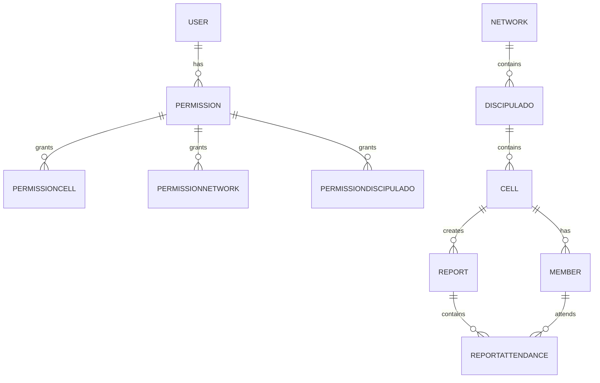

# Videira Caruaru — Backend (API)

Este diretório contém a API do projeto "Videira Caruaru". A API é construída com Node.js/TypeScript e utiliza Prisma como ORM para PostgreSQL.

## Sumário

- [Requisitos](#requisitos)
- [Rodando localmente](#rodando-localmente)
- [Variáveis de ambiente](#variáveis-de-ambiente)
- [Estrutura do banco de dados (Prisma)](#estrutura-do-banco-de-dados-prisma)
- [Diagrama ER (mermaid)](#diagrama-er-mermaid)
- [Migrations e Prisma Client](#migrations-e-prisma-client)
- [Endpoints principais (resumo)](#endpoints-principais-resumo)

## Requisitos

- Node.js 18+ e npm
- PostgreSQL (pode ser iniciado via `docker-compose.yml` presente no repositório)

## Rodando localmente

1. Instale dependências:

```powershell
cd videira-caruaru-api
npm install
```

2. (Opcional) Inicie o Postgres com Docker:

```powershell
docker-compose up -d
```

3. Rode migrations e gere o cliente Prisma:

```powershell
npx prisma migrate dev
npx prisma generate
```

4. Inicie a API em modo desenvolvimento:

```powershell
npm run dev
```

## Variáveis de ambiente

- `DATABASE_URL` — string de conexão com o Postgres
- `API_PORT` — porta que a API deve escutar
- `JWT_SECRET`, `JWT_ISSUER` — configuração para tokens JWT

## Estrutura do banco de dados (Prisma)

A seguir as tabelas (modelos Prisma) presentes em `prisma/schema.prisma`, com campos e relações.

1) `User`
   - `id: Int` (PK, autoincrement)
   - `email: String` (unique)
   - `password: String?`
   - `firstName: String`
   - `lastName: String`
   - `phoneNumber: String?`
   - `firstAccess: Boolean` (default: `true`)
   - `timezone: String` (default: `UTC`)
   - `createdAt: DateTime` (default: `now()`)
   - `updatedAt: DateTime` (@updatedAt)
   - Relação: `permission: Permission?` (1:1)

2) `Cell`
   - `id: Int` (PK)
   - `name: String` (unique)
   - `leaderUserId: Int?` (opcional)
   - `createdAt`, `updatedAt`
   - Relações: `members: Member[]`, `reports: Report[]`, `permissionCells: PermissionCell[]`, `discipulado: Discipulado?`

3) `Member`
   - `id: Int` (PK)
   - `name: String`
   - `status: MemberStatus` (enum: `ACTIVE` | `INACTIVE`)
   - `cellId: Int` (FK -> `Cell.id`)
   - `createdAt`, `updatedAt`
   - Relações: `cell: Cell`, `attendances: ReportAttendance[]`

4) `Permission`
   - `id: Int` (PK)
   - `userId: Int` (unique, FK -> `User.id`)
   - `hasGlobalCellAccess: Boolean` (default: `false`)
   - `canManageCells: Boolean` (default: `false`)
   - `canManagePermissions: Boolean` (default: `false`)
   - `role: String?` (default: `USER`)
   - `createdAt`, `updatedAt`
   - Relações: `user: User`, `permissionCells`, `permissionNetworks`, `permissionDiscipulados`

5) `Network`
   - `id: Int` (PK)
   - `name: String` (unique)
   - `createdAt`, `updatedAt`
   - Relações: `discipulados: Discipulado[]`, `permissionNetworks: PermissionNetwork[]`

6) `Discipulado`
   - `id: Int` (PK)
   - `name: String`
   - `networkId: Int` (FK -> `Network.id`)
   - `createdAt`, `updatedAt`
   - Relações: `network: Network`, `cells: Cell[]`

7) `PermissionNetwork` (junção permission <-> network)
   - `id: Int` (PK)
   - `permissionId`, `networkId` (FKs)
   - Constraint: `@@unique([permissionId, networkId])`

8) `PermissionDiscipulado` (junção permission <-> discipulado)
   - `id: Int` (PK)
   - `permissionId`, `discipuladoId` (FKs)
   - Constraint: `@@unique([permissionId, discipuladoId])`

9) `PermissionCell` (junção permission <-> cell)
   - `id: Int` (PK)
   - `permissionId`, `cellId` (FKs)
   - Constraint: `@@unique([permissionId, cellId])`

10) `Report`
   - `id: Int` (PK)
   - `createdAt: DateTime` (default now)
   - `cellId: Int` (FK -> `Cell.id`)
   - Relações: `attendances: ReportAttendance[]`

11) `ReportAttendance`
   - `id: Int` (PK)
   - `reportId: Int` (FK -> `Report.id`)
   - `memberId: Int` (FK -> `Member.id`)
   - Indexes: `@@index([reportId])`, `@@index([memberId])`
   - Unique: `@@unique([reportId, memberId])`

### Observações

- Relacionamentos definem `onDelete` (Cascade / NoAction) — ver `schema.prisma` para detalhes exatos.
- Campos com `@default(...)` (timestamps, flags) têm valores automáticos.

## Diagrama ER (mermaid)



## Migrations e Prisma Client

- Migrations ficam em `prisma/migrations/`.
- Gere o client Prisma com `npx prisma generate` após alterações no schema.

## Endpoints principais (resumo)

- Autenticação: `POST /api/v1/users/login`, `POST /api/v1/users/register`
- Usuários: `GET/POST/PUT/DELETE /api/v1/users`
- Células e membros: endpoints CRUD (`/cells`, `/members`)
- Relatórios: `POST /api/v1/reports` e `GET /api/v1/reports` (por célula)
- Permissões: endpoints para gerenciar permissões e associações (cells/networks/discipulados)

Para a lista completa das rotas, consulte os controllers em `src/modules/*/controller`.

---